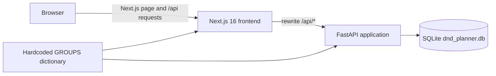
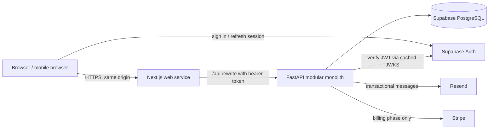
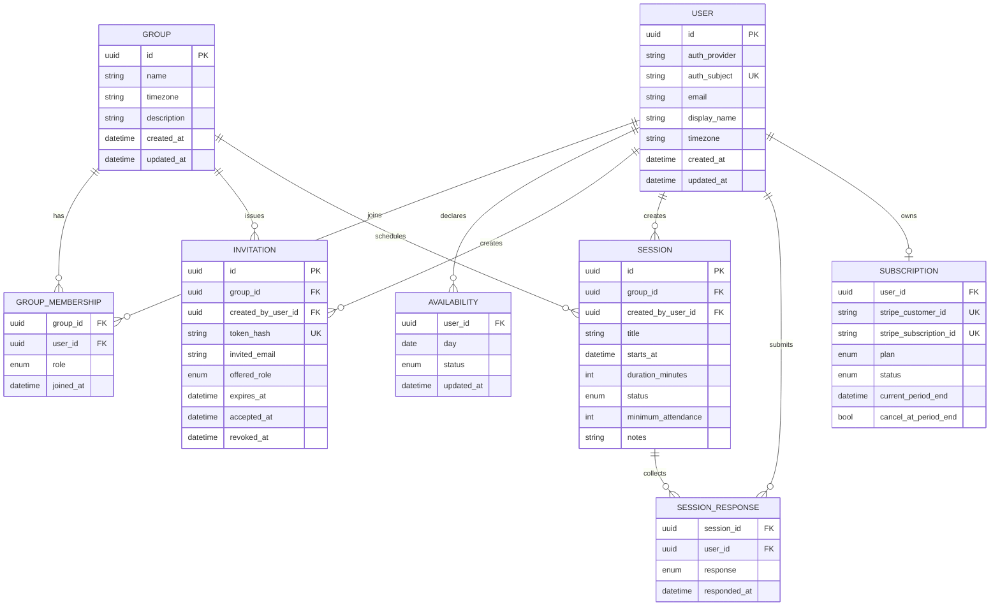

# DnD Planner SaaS Roadmap

Status: architecture proposal only  
Reviewed against repository commit: `762cbc3`  
Review date: 2026-08-08

## Executive recommendation

Evolve the product incrementally as a small modular monolith:

- Keep Next.js, TypeScript, FastAPI, and the current fast calendar interaction.
- Keep one repository, one FastAPI application, and one relational database. Do not add microservices, queues, or Redis yet.
- Introduce SQLAlchemy 2 and Alembic before changing the data model.
- Use PostgreSQL in production and a one-service Docker Compose PostgreSQL instance for production-parity local development once the persistence migration starts.
- Use Supabase Auth for email magic links/OTP and Supabase-managed PostgreSQL. FastAPI should verify Supabase JWTs and remain the only application-data API.
- Deploy the Next.js and FastAPI services from this monorepo on Railway. This keeps runtime hosting in one place while Supabase provides auth, PostgreSQL, and backups.
- Charge organizers, not members. A useful FREE plan should support normal group scheduling; PRO should unlock multi-group and automation conveniences.
- Add Stripe only after the authenticated product is deployed and useful.

The current application already has a useful interaction model. The safest path is to preserve it behind better boundaries, not rewrite it.

---

## 1. Current architecture

### Runtime



The repository contains two runtime processes:

- `frontend/` is a Next.js 16 App Router application using React 19, TypeScript, Tailwind CSS 4, Radix-based UI primitives, `date-fns`, and Lucide icons.
- `backend/` is a synchronous FastAPI application using Python's built-in `sqlite3` driver.
- The browser calls `/api/*`. `frontend/next.config.ts` rewrites those requests to FastAPI at `http://127.0.0.1:8000`.
- FastAPI reads and writes the repository-root `dnd_planner.db` file.
- `start_app.sh` starts FastAPI and a previously built Next.js production server. `dnd-planner.service` points to an old absolute development path and is not portable.

### Backend

`backend/main.py` contains the entire HTTP API:

- `GET /groups`
- `GET /availability/{group}/{year}/{month}`
- `POST /availability`
- `GET /admin/all-availability`
- `GET /test-health`

`backend/database.py` contains all persistence and domain behavior:

- Three groups and twelve distinct player profiles are hardcoded by mutable names.
- SQLite schema creation runs as an import side effect.
- The single `availability` table uses `(group_name, user_name, date)` as its primary key.
- A user's update is copied to all hardcoded groups containing that user.
- Reads expand older rows across all of that user's groups, preserving the current product rule that availability applies globally.

The SQL uses parameters for user data. There is no obvious SQL-injection issue in the existing queries; the one dynamically built SQL fragment only constructs the number of `?` placeholders. This good practice should be preserved.

### Frontend

Most frontend behavior and markup live in the 1,400-line `frontend/src/app/page.tsx` client component. It owns:

- profile selection persisted in `localStorage`;
- group and availability fetching;
- optimistic availability writes;
- month/year navigation;
- personal, group, cross-group, and one-shot recruiter views;
- best-date calculations and cross-group conflict warnings;
- context menus, detail modals, and the special Rico/Gaelle synchronization behavior;
- almost the entire desktop application shell.

`CalendarGrid.tsx` is the main extracted product component. `frontend/src/services/api.ts` is a small centralized API client. Theme handling and several shadcn-style UI primitives are also separated.

### Current workflows worth preserving

- A date click cycles `Available -> Maybe -> Unavailable -> clear`.
- Right-click offers direct status selection.
- Optimistic updates make the calendar feel immediate.
- A user can see personal and aggregate availability together.
- The app already computes promising dates and warns about shared-player conflicts.
- Cross-group comparison and one-shot recruiting are differentiated product ideas, not generic CRUD.
- Dark mode, visible focus styles, descriptive date labels, and semantic buttons provide a useful accessibility foundation.

### Existing data

The newly checked-out workspace database is empty, but the active legacy WSL checkout contains real data:

- 324 availability rows;
- dates from 2026-01-01 through 2026-05-22;
- 324 distinct `(user_name, date)` pairs;
- no conflicting statuses for the same `(user_name, date)` pair.

The legacy WSL database—not the empty workspace database—must be treated as the migration source unless the operator explicitly selects another file.

---

## 2. Current problems

### Critical: SaaS and security blockers

| Problem | Impact | Required direction |
|---|---|---|
| No authentication | Anyone who can reach the API can impersonate any named player. | Verify a real session on every protected endpoint. |
| No authorization | Any caller can read all availability and write for any group/user. | Scope every query by the authenticated user and validated membership. |
| Public admin endpoint | `/admin/all-availability` exposes all groups' data without authentication. | Replace it with membership-scoped group and cross-group queries; do not retain a customer-facing global endpoint. |
| Identity is a mutable display name | Renames, duplicate names, and account claiming are unsafe. | Use immutable UUIDs and keep display names as attributes. |
| Input is insufficiently constrained | `status`, group names, user names, and practical date ranges are not validated. Arbitrary statuses and nonexistent identities can be stored. | Use enums, foreign keys, checks, bounded date ranges, and Pydantic validation. |
| Health endpoint leaks a filesystem path | Infrastructure details are exposed. | Return only health/readiness state; log details server-side. |

These issues make the current app appropriate only for a trusted private network. CORS is not an authorization boundary and does not mitigate them.

### High: data and reliability limitations

- Groups and memberships are hardcoded, so users cannot create, join, leave, rename, or administer groups.
- Schema creation on import is not a migration system and cannot safely evolve production data.
- SQLite has no configured busy timeout, WAL mode, managed backup, or multi-instance write strategy. It is acceptable for the prototype but not for a scaled multi-instance deployment.
- The schema lacks foreign keys, `NOT NULL`, status checks, timestamps, and indexes for the queries the SaaS will need.
- Group and user names appear in URLs and primary keys. Names containing `/` are unsafe as path identifiers, and renames are effectively data migrations.
- Availability propagation performs redundant writes and client fan-out. A single user/date fact is duplicated by group even though the product treats it as global.
- Normal optimistic updates have no rollback or user-visible failure path. A failed request can leave the UI showing data that was never stored.
- Fetch errors are not handled. Initial group failure leaves a permanent spinner, and later failures can produce stale or empty screens without explanation.
- There are no automated tests, migrations, CI checks, production build gate, or reproducible Python dependency lock.
- `requirements.txt` is unpinned and includes unused `streamlit` and `pandas` dependencies.

### High: UX limitations

- The fixed 300 px sidebar, 40 px main padding, seven 80 px calendar cells, and desktop-first layout do not fit a typical phone viewport.
- The sidebar starts expanded and has no mobile drawer/bottom-navigation behavior.
- Right-click is undiscoverable and unavailable on touch devices. The primary click cycle is fast but can be confusing without a visible status legend or undo.
- Profile selection is both onboarding and identity. It exposes every person and cannot survive real authentication.
- All product views share one route and component, so browser history, deep links, focused loading states, and maintainable feature boundaries are absent.
- Loading, empty, error, offline, saving, and retry states are incomplete.
- The day-details modal lacks dialog semantics, focus trapping, Escape handling, and focus restoration.
- Cross-group details can show duplicate people because memberships and expanded availability are combined by name.
- The Rico/Gaelle sync action and custom player avatars are personal rules embedded in production UI logic.
- The initial loading screen has no failure timeout, message, or recovery action.

### Medium: maintainability and scale

- `page.tsx` mixes API orchestration, permissions assumptions, domain calculations, state, and view markup.
- Date summaries repeatedly filter arrays inside every calendar cell. This is fine for today's data, but avoidable quadratic work becomes noticeable with more groups and history.
- API response types are handwritten and use unrestricted strings rather than shared/generated enums.
- There is no environment configuration contract. The backend URL, allowed origins, database path, and runtime mode are hardcoded.
- The systemd unit points to a stale absolute path, and the production start script assumes a prebuilt frontend without performing readiness checks.
- The frontend README is still the generic Create Next App document.
- The repository contains unused stock assets and UI primitives. They are harmless but obscure what the product actually uses.

### What is already good enough

- Next.js, FastAPI, and the monorepo are appropriate choices.
- A separate API client module is the right boundary to extend.
- `CalendarGrid` is a useful reusable component with semantic buttons, focus styles, and ARIA labels.
- Parameterized SQL should remain the standard.
- The UI already has personality without being locked completely to D&D terminology.
- No Redux, event bus, cache server, or complex backend layering is needed.

---

## 3. Proposed architecture

### Shape: a small modular monolith



There should still be only two application services: the Next.js web application and the FastAPI API. The API remains one deployable process with internal modules. PostgreSQL is the only application datastore. Background work should run inline when cheap; add a worker only when measured email/webhook workloads require one.

### Technology decisions

| Concern | Recommendation | Why |
|---|---|---|
| Frontend | Keep Next.js 16 App Router, React, TypeScript, Tailwind, and Radix/shadcn primitives. | It is current, typed, familiar in this repo, and well suited to auth pages plus an interactive client calendar. |
| Frontend state | Keep local React state initially. Add TanStack Query only when authenticated multi-page request caching and mutation rollback become repetitive. Do not add Redux. | Avoids a premature state framework while leaving a clear upgrade point. |
| API typing | Pydantic response/request schemas plus generated TypeScript types from FastAPI OpenAPI using `openapi-typescript`. | One source of truth prevents the current string/status drift without building a shared-language package. |
| Backend | Keep FastAPI as one synchronous application, split into routers and small service modules. | Current workload is I/O-light; synchronous SQLAlchemy is easier to reason about and supports thousands of users with normal process scaling. |
| Configuration | `pydantic-settings` with a committed `.env.example`; secrets only in local `.env` or host secret stores. | Typed startup validation and one obvious configuration contract. |
| Database | PostgreSQL for production; local PostgreSQL through one Docker Compose service once Phase 1 begins. | Foreign keys, constraints, concurrent writes, managed backups, and standard hosting. |
| ORM | SQLAlchemy 2 typed declarative models, used directly from route-specific services. | Mature PostgreSQL support and first-class Alembic integration. SQLModel saves little here and couples API schemas to persistence too easily. |
| Migrations | Alembic, with every schema change represented by a reviewed migration. | Standard SQLAlchemy migration path and safe incremental rollout. |
| IDs | Native PostgreSQL UUID, generated as UUIDv4. | Opaque stable public IDs avoid name-based resources. UUIDv4 is simpler than introducing UUIDv7 and is sufficient at this scale. IDs never replace authorization. |
| Authentication | Supabase Auth, initially email magic link/OTP; optional Google login only after demand. | Managed credential security, good Next.js UX, JWT/JWKS verification that FastAPI can perform locally, and the same provider can host PostgreSQL. |
| Email | Resend for application email and Supabase custom SMTP in production. | Straightforward API and a free tier currently covering 3,000 transactional emails/month; one provider can handle invites, auth, and reminders. |
| Payments | Stripe Checkout, Billing, Customer Portal, and signed webhooks in a later phase. | Widely supported subscription lifecycle without storing payment details. |
| Hosting | Railway for both Next.js and FastAPI; Supabase for Auth/PostgreSQL. | Railway can deploy both services from the monorepo, provides private networking/logs, and currently has a $5 minimum Hobby tier. This avoids a third runtime provider. |
| CI/CD | GitHub Actions for tests/lint/build; Railway auto-deploys `main` only after required checks pass. | Simple, visible, and sufficient for one developer. |
| Logging/monitoring | Standard Python structured logs, platform logs, request IDs, health checks, and Sentry at production launch. | Useful diagnostics without operating a logging stack. Do not log tokens, invite secrets, or availability payloads. |

### Authentication comparison

| Option | Complexity with Next.js + FastAPI | Lock-in / cost | Decision |
|---|---|---|---|
| Supabase Auth | The frontend obtains a managed access token; FastAPI verifies asymmetric JWTs from the documented JWKS endpoint. Auth and PostgreSQL share one provider. | Open-source foundation; Free currently includes 50k MAU, Pro starts at $25/month and includes daily backups. Some provider coupling remains. | **Recommended.** Best balance of cross-stack simplicity, cost, and portability. |
| Clerk | Excellent prebuilt Next.js UI and an official Python backend SDK; probably the fastest polished integration. | Separate identity provider and stronger UI/API lock-in. Hobby currently includes 50k monthly retained users; Pro starts at $20/month. | Strong fallback if auth UI speed matters more than provider consolidation. |
| Auth.js | Free and open source, with excellent Next.js integration. | Session and credential handling lives in the Next.js runtime. A separate FastAPI API then needs a secure token or trusted-BFF bridge, increasing custom security work. | Do not choose for this two-backend-language shape. |
| Better Auth | Open source, Next.js 16 compatible, database-backed sessions, and JWT/JWKS plugins. | Adds a TypeScript auth server/schema/migration owner beside the Python application's SQLAlchemy/Alembic ownership. More security operations remain with the solo developer. | Reconsider only if self-hosting auth becomes a firm requirement. |

Relevant current provider documentation is linked in [Decision references](#decision-references).

### Backend module layout

Use a shallow structure. Do not add repository interfaces or dependency-injection containers.

```text
backend/
  app/
    main.py
    config.py
    db.py
    models.py
    schemas.py
    auth.py
    permissions.py
    entitlements.py
    routers/
      me.py
      groups.py
      availability.py
      invitations.py
      sessions.py
      billing.py          # added only in the billing phase
    services/
      scheduling.py
      invitations.py
      billing.py          # added only in the billing phase
  migrations/
  tests/
```

Routes may use SQLAlchemy directly for straightforward CRUD. A service module is warranted only for business rules used by multiple routes or needing focused tests: date ranking, invitations, permissions, and billing transitions.

### API direction

Use `/v1` and IDs in paths. A representative API is:

- `GET /v1/me`
- `GET /v1/me/entitlements`
- `GET /v1/me/availability?from=YYYY-MM-DD&to=YYYY-MM-DD`
- `PUT /v1/me/availability/{date}`
- `DELETE /v1/me/availability/{date}`
- `GET /v1/groups`
- `POST /v1/groups`
- `GET/PATCH/DELETE /v1/groups/{group_id}`
- `GET /v1/groups/{group_id}/members`
- `PATCH/DELETE /v1/groups/{group_id}/members/{user_id}`
- `GET /v1/groups/{group_id}/availability?from=...&to=...`
- `POST /v1/groups/{group_id}/invitations`
- `GET/POST /v1/invitations/{token}` for preview/acceptance
- `GET/POST /v1/groups/{group_id}/sessions`
- `GET /v1/groups/{group_id}/date-suggestions?from=...&to=...`

The API should return `401` for no/invalid identity, `403` for insufficient membership/role, and `404` when a resource should not be disclosed. Pagination is unnecessary for month-sized availability queries but should be used for sessions and invitations once those lists can grow.

Keep browser requests same-origin through Next.js. The FastAPI service can be private on Railway. If it must be public, configure exact allowed origins from environment variables; never use wildcard origins with credentials.

### Deployment options considered

1. **Recommended: Railway app services + Supabase Auth/PostgreSQL.** Two vendors, low operational load, simple monorepo deploys, and no production database to administer. Railway currently uses a $5 minimum Hobby plan; Supabase Pro starts at $25/month. Pre-launch development can remain on their free tiers where terms permit.
2. **Vercel Pro frontend + Railway API + Supabase.** Best Next.js preview/deployment experience, but adds another provider and at least $20/month for commercial use. Vercel Hobby is explicitly limited to personal, non-commercial use, so it is not the production SaaS plan.
3. **Render for both apps and PostgreSQL.** A viable consolidated alternative, but free web services spin down and free PostgreSQL expires after 30 days with no backups; those free offerings are unsuitable for production.
4. **Single VPS with Docker Compose.** Potentially cheapest at stable traffic, but the solo developer owns patching, firewalling, TLS/reverse proxy, database backups, restore tests, monitoring, and incident response. Reconsider after revenue or cost pressure justifies that work.
5. **Fly.io.** Flexible and inexpensive compute, but its granular machines, networking, volumes, and database choices create more operational decisions than Railway for this product.

Expected initial production infrastructure is roughly $30/month before email overages and Stripe fees if app-service usage stays within Railway's included/minimum spend, or roughly $50/month with Vercel Pro added. Re-check prices immediately before launch.

---

## 4. Proposed domain model

### Relationship model



### Model decisions and constraints

#### User

- Application users have their own UUID rather than using the authentication provider's identifier as the primary key.
- `(auth_provider, auth_subject)` is unique. This keeps an eventual provider migration possible without changing every foreign key.
- Email is normalized and unique for active accounts. Display name is not unique and can be changed.
- `timezone` is an IANA timezone, defaulted during onboarding from the browser but editable.
- Legacy imported profiles may temporarily have no auth subject while they await a secure account-claim flow.

#### Group and GroupMembership

- `Group` uses neutral scheduling language. D&D flavor belongs in copy/themes, not schema names.
- Membership has exactly one of `owner`, `organizer`, or `member`.
- `(group_id, user_id)` is unique.
- Each group must have exactly one owner. Enforce this with a PostgreSQL partial unique index on owner memberships plus transactional ownership transfer logic.
- Owner cannot leave until ownership is transferred or the group is deleted.
- Do not create a generic Organization/Workspace/Team model. A group is the collaboration boundary.

#### Availability

Availability should initially remain **global per user and calendar date**, because that is explicit current behavior and enables useful cross-group conflict detection. The unique key is `(user_id, day)`, not `(group_id, user_id, day)`. A group's calendar is derived by joining its active memberships to those users' availability.

This removes the current duplicate/fan-out writes while preserving behavior. It also means “Available” means generally available for activities that day, not a promise to a specific group. Do not add group-specific overrides until users demonstrate that they need them.

Use a database enum or check-constrained string: `available`, `maybe`, `unavailable`. No row means not answered. Availability dates are date-only values interpreted in the user's/group's calendar context, not UTC timestamps.

#### Session

A session converts a promising date into a concrete plan:

- `starts_at` is stored in UTC; the group's IANA timezone controls display and input conversion.
- `status` is initially `scheduled`, `cancelled`, or `completed`.
- `minimum_attendance` is optional and powers date suggestions.
- `SessionResponse` is separate from availability because “I was generally available” and “I confirm this specific event” are different facts.
- Keep notes as plain text. Do not build rich documents, locations, maps, or chat yet.

#### Invitation

- Generate at least 32 random bytes for the raw token. Store only a cryptographic hash.
- A token belongs to one group, expires, can be revoked, and initially offers only the `member` role. Organizers can be promoted after joining.
- `invited_email` is optional. When present, acceptance requires the same verified email.
- Start with single-use links. Add reusable links only when a real group workflow requires them.
- The invitation preview may be public and show limited group information; acceptance requires authentication.

#### Subscription and entitlements

- A subscription belongs to the organizer user. PRO benefits apply to groups that user owns, and all members can use the enabled group features.
- Store Stripe identifiers and a normalized local status, but treat signed Stripe webhooks as the source of billing state.
- Do not create editable `plans` or `features` database tables initially. Define a small typed `Feature` enum and plan-to-entitlement mapping in code.
- Centralize checks in `entitlements.py`, for example `resolve_entitlements(user)` and `require_group_feature(user, group, Feature.CROSS_GROUP)`. The frontend receives capabilities for presentation, but the API remains authoritative.

---

## 5. Authentication and authorization model

### Sign-in and onboarding

1. A user signs in with a Supabase email magic link/OTP.
2. The Next.js frontend maintains the Supabase session and includes the access token as `Authorization: Bearer <token>` on `/api` requests.
3. FastAPI validates signature, issuer, audience, and expiry using a cached JWKS. It never trusts decoded claims without verification.
4. FastAPI maps `(provider="supabase", sub)` to the application `User`, creating the profile transactionally on first authenticated access.
5. The user sets or confirms display name and timezone, then lands directly in their most recent group or group list.

Do not initially implement passwords, passkeys, multiple social providers, MFA, or custom session storage. Add Google login only if users ask for it. Supabase owns credential recovery and token refresh.

### Lightweight invitation flow

Anonymous availability writes create difficult identity, spam, abuse, and later account-merging problems. Instead:

1. `/join/{raw_token}` shows a minimal invitation preview without sign-in: group name, inviter display name, expiration, and one “Join group” action.
2. The user enters an email or continues with an existing session.
3. A magic link returns directly to the invitation acceptance route.
4. Acceptance creates the membership and immediately opens the calendar.

This defers account friction until the user expresses intent while keeping every write attached to a verified identity.

### Permission matrix

| Action | Member | Organizer | Owner |
|---|---:|---:|---:|
| View group/member availability | Yes | Yes | Yes |
| Set own availability | Yes | Yes | Yes |
| Respond to a session | Yes | Yes | Yes |
| Create/edit/cancel sessions | No | Yes | Yes |
| Create/revoke invitations | No | Yes | Yes |
| Remove ordinary members | No | Yes | Yes |
| Promote/demote organizers | No | No | Yes |
| Rename/configure group | No | Yes | Yes |
| Transfer ownership/delete group | No | No | Yes |
| Manage billing | No | No | Yes, through owner's subscription |

### API authorization pattern

- `get_current_user` authenticates every non-public request.
- `require_membership(group_id)` loads the membership and returns `404` when exposing group existence would leak information.
- `require_role(group_id, organizer_or_owner)` handles organizer operations.
- A user ID supplied by the client is never used for “my” writes; FastAPI takes the subject from the verified session.
- Cross-group tools may only compare groups where the caller is a member and where the relevant feature entitlement is active.
- The current global admin availability endpoint is removed. Operator support actions should be explicit CLI commands or a future separately protected staff interface.
- Role and entitlement checks live server-side near route entry. SQL queries should also include group/user scope so an accidental later refactor cannot return global data.

### Security baseline

- Same-origin browser API routing and exact production origins only.
- Bearer-token API authentication, which avoids cookie-based CSRF on FastAPI writes. Protect any future cookie-mutating Next.js routes with SameSite cookies, Origin checks, and framework CSRF guidance.
- Short bounded availability ranges, payload-size limits, enum validation, and normalized errors.
- Rate-limit invitation preview/acceptance, group creation, email sending, and billing endpoints at the hosting edge or application boundary. Do not add Redis merely for rate limiting at initial scale.
- Hash invitation tokens and verify Stripe webhook signatures against the raw request body.
- Never expose Supabase service-role keys or Stripe secrets to the browser.
- No secrets in Git; validate required production environment variables at startup.
- Dependabot/Renovate can propose dependency updates, but CI and human review must gate merges.
- Do not log tokens, raw invite links, email message bodies, or full availability payloads.

---

## 6. FREE vs PRO

The monetization boundary should be “basic group scheduling versus organizer convenience,” not “members can participate only if somebody pays.” Members should never need a subscription to answer availability or confirm a session.

### FREE

- Account creation and magic-link sign-in.
- Join unlimited groups.
- Own up to two active groups.
- Unlimited members per group within a reasonable abuse policy.
- Invitation links.
- Available / Maybe / Unavailable calendar.
- Mobile-friendly calendar and selected-date member summary.
- Basic best-date suggestions: everyone available, available-or-maybe, and highest attendance.
- Create and confirm ordinary sessions/events.
- Three months of past calendar history and at least twelve months of future planning.
- Essential transactional email: invitation, selected/cancelled session, and security messages.
- Dark mode and standard group appearance.

This supports a real recurring group indefinitely. The two-group limit is generous for normal users and gives frequent organizers a natural reason to upgrade.

### PRO

- Unlimited owned groups, subject to fair use.
- Cross-group availability and conflict comparison.
- One-shot/guest recruiter tools.
- Advanced date rules: organizer-defined minimum attendance, weighted “maybe,” exclusions, and ranked explanations.
- Recurring availability patterns and bulk editing.
- Recurring sessions.
- Reminder emails and “members who have not answered” tools.
- Longer history and basic participation/response statistics.
- iCal export/subscription and CSV export.
- Additional organizer conveniences, custom group accent/icon, and saved defaults.
- Future Discord integration if demand supports its maintenance cost.

PRO entitlement should follow the group owner. Everyone in a PRO-owned group benefits from group features, which makes the upgrade easy to understand and avoids per-member friction.

### Features to validate before gating

- Basic session creation should remain free because it completes the core availability-to-event loop.
- Basic date suggestions should remain free because raw counts alone do not deliver the product's core value.
- Calendar history limits should be a storage/convenience distinction, not rapid deletion that pressures users.
- Do not cap members aggressively. Member limits damage invitations and group adoption more than they drive healthy conversion.

---

## 7. Pricing suggestion

### Model A: per organizer — recommended

- FREE: €0.
- PRO: **€4.99/month or €49/year per organizer**.
- PRO applies to every group that organizer owns.
- Members and co-organizers do not pay merely to participate.

Why it fits: the organizer receives the automation and multi-group value, one person can make the purchase decision, invitations remain frictionless, and billing state maps cleanly to the proposed user-owned subscription.

Launch option: offer an early-adopter annual price around €39 while clearly preserving the eventual standard price. Avoid lifetime plans because email, hosting, and support costs recur.

### Model B: per active group

- €2.99/month or €29/year for each PRO group.

Advantages: payment maps directly to the group receiving features and can be shared socially. Disadvantages: multi-group organizers face repeated purchase choices, inactive groups create cancellation questions, and ownership transfer complicates billing. This is viable but less simple than Model A.

### Model C: per active member — not recommended initially

- Approximately €1/member/month with a €5 minimum.

This resembles team SaaS pricing but is a poor fit for friend groups: every invitation changes cost, organizers may avoid adding occasional players, and tabletop users compare it unfavorably with free chat/calendar tools. Keep it only as a future option for a distinct small-team market.

### Pricing validation

Before implementing Stripe, interview or survey at least 10 active organizers using a clickable pricing page. Measure whether “two groups free, unlimited with PRO” is understandable and whether annual billing feels appropriate. Pricing copy and willingness to pay should be validated before the database model becomes more complex than `FREE` and `PRO`.

---

## 8. UX improvements

### Product information architecture

Move from one conditional page to a few durable routes:

```text
/                       landing or recent-group redirect
/sign-in                authentication
/groups                 groups the user belongs to
/groups/new             simple group creation
/groups/{id}            default calendar
/groups/{id}/sessions   scheduled sessions
/groups/{id}/settings   organizer settings and members
/join/{token}           invitation preview/acceptance
/account                profile, subscription, security
```

Cross-group tools can live under `/tools/compare` and `/tools/recruit` once PRO exists. Do not create a dashboard full of metrics as the default destination.

### Onboarding

- Returning users should land directly in their most recently used group/calendar.
- New users choose only display name and timezone, then either create a group or accept the invitation that brought them.
- Group creation asks for name and timezone only. Description, appearance, and advanced rules are optional settings later.
- Use neutral language such as “Group” and “Session,” with subtle dice/icon personality in empty states and illustrations.

### Joining a group

- Show an invitation preview before authentication.
- Preserve the return URL through magic-link sign-in.
- After acceptance, open the current month and show a one-sentence interaction hint.
- Clearly handle expired, revoked, already-used, wrong-email, already-a-member, and full/disabled group states.

### Calendar interaction

- Keep direct date clicking and optimistic feedback.
- Add a visible compact status selector/legend above the calendar. On touch, tapping a date can apply the currently selected status; keep cycling as an optional rapid mode if users prefer it.
- Add undo for the most recent change and rollback with a clear retry toast on API failure.
- Show per-cell saving/error indicators only when needed; do not block the whole calendar.
- Pre-index month data by date and user once instead of repeatedly filtering arrays in every render.
- Keep “Best dates,” but explain why each date ranks highly and let selecting one open the detail panel.
- Do not make “Maybe” count as fully available without showing the distinction.

### Mobile

- Replace the permanent sidebar with a compact top bar and bottom navigation or drawer below the desktop breakpoint.
- Reduce calendar gaps and cell minimum heights on narrow screens; display status with color plus symbol, not text alone.
- Provide an optional agenda/list view for very narrow phones and accessibility zoom.
- Use a bottom sheet for day details/status changes rather than a centered desktop modal.
- Keep primary actions at least 44×44 CSS pixels and test at 320, 375, 390, 768, and desktop widths.
- Avoid horizontal scrolling for the main workflow.

### Scheduling a session

Use one short flow:

1. Calendar highlights top candidate dates.
2. Organizer selects a date and chooses “Schedule session.”
3. A small form asks for start time, duration, optional title, and optional minimum attendance.
4. Members receive an in-app/email notice and confirm Going/Maybe/Declined.
5. The session appears above the calendar and in `/sessions`.

Do not introduce a wizard, venue management, chat, or task lists.

### Reliability and accessibility

- Every data surface needs loading, empty, error, retry, and stale/offline behavior.
- Use route-level error boundaries and skeletons that resemble the content.
- Replace `alert()` with accessible inline/toast feedback.
- Use Radix Dialog/Popover primitives for focus trapping, Escape, outside-click, and screen-reader semantics.
- Preserve focus after mutations and modal closure.
- Ensure status is represented by text/symbol as well as color, and verify contrast in both themes.
- Add browser titles and deep links for each group/session.

---

## 9. SaaS migration strategy

### Principles

- Keep the application runnable after every phase.
- Introduce a compatibility boundary before changing both storage and UI behavior.
- Back up and verify data before every destructive migration.
- Never use the current name-selection screen as an account-claim mechanism.
- Switch API consumers in the same phase as each breaking API change.
- Do not delete legacy tables/files until the new production data has been verified and backed up.

### Legacy data migration

1. Stop writes briefly and copy `/home/dedoo/dnd_planner/dnd_planner.db` to a timestamped, read-only backup outside the repository.
2. Run a dry-run importer that reports source schema, row count, distinct users/dates, invalid statuses, duplicate rows, and conflicting statuses without writing.
3. Create deterministic mappings from the three hardcoded group names and twelve profile names to new UUID records. Store the generated mapping in migration output, not hand-written application constants.
4. Create group memberships from the current `GROUPS` dictionary. The operator explicitly selects one owner for each legacy group; do not guess ownership from player order.
5. Collapse legacy availability into `(user_id, day, status)`. The current inspected data has 324 rows, 324 distinct user/date pairs, and no status conflicts. The importer must still fail and report details if future source data contains a conflict.
6. Import transactionally and idempotently. A rerun must produce no duplicates.
7. Compare source/target counts and per-user/date checksums, then run API regression tests and a read-only UI smoke test.
8. Keep legacy profiles unclaimed until a secure claim link is issued. Claim links are single-use, expiring, and generated by an operator after associating a verified email. Users must never claim a profile by selecting its public display name.
9. Run old and new read paths against the same fixture during development. At cutover, stop the old service, perform one final import, verify, and start the new service.
10. Retain the encrypted/read-only SQLite backup for a documented period and perform one restore rehearsal before declaring migration complete.

### SQLite to PostgreSQL sequencing

- Build SQLAlchemy/Alembic support while tests can still use temporary SQLite for speed.
- Add PostgreSQL-specific CI integration tests before production migration.
- Use a local Docker Compose PostgreSQL service for manual development parity; do not add Docker for the frontend/backend unless deployment later needs it.
- Production cutover is a data export/import and `DATABASE_URL` change, not a code rewrite.
- Use managed connection pooling and conservative SQLAlchemy pool sizes in hosted environments.

---

## 10. Implementation roadmap

### Phase 0 — Reproducible baseline

**Goal:** make the current product safe to change without altering user-facing behavior.

**Exact changes**

- Add `.env.example` and typed backend settings for database URL, API upstream, allowed origins, environment, and log level.
- Replace unpinned `requirements.txt` with `pyproject.toml` and `uv.lock`; remove unused `streamlit` and `pandas`.
- Add Ruff for Python lint/format and retain ESLint/TypeScript for frontend checks.
- Add a WSL-friendly development script that starts both processes, checks ports, traps shutdown correctly, and documents the Windows-accessible URL.
- Make the health endpoint return safe liveness/readiness data without a filesystem path.
- Parameterize the Next.js API upstream with an environment variable.
- Add regression tests for current groups, month reads, status cycling inputs, global cross-group behavior, and failure responses.
- Add GitHub Actions running backend tests/lint and frontend lint/typecheck/production build.
- Replace the generic frontend README with repository-specific setup/troubleshooting.

**Important files/modules**

- `.env.example`, `pyproject.toml`, `uv.lock`, `.github/workflows/ci.yml`
- `backend/main.py`, planned `backend/app/config.py`
- `frontend/next.config.ts`, `frontend/package.json`
- `scripts/dev.sh`, `README.md`

**Migration considerations:** none. Existing SQLite schema and behavior remain intact.

**Tests required:** current API regression suite, backend lint, frontend ESLint, TypeScript check, production build.

**Definition of done:** a clean checkout can be configured from `.env.example`, started in WSL, and fully checked by one documented command; CI passes with no production behavior change.

### Phase 1 — Persistence foundation and legacy import

**Goal:** introduce a real domain schema and migrations while preserving current data and calendar behavior.

**Exact changes**

- Add SQLAlchemy 2, Alembic, and a session dependency.
- Add `users`, `groups`, `group_memberships`, and global `availability` models with UUIDs, enums/checks, foreign keys, timestamps, unique constraints, and query indexes.
- Keep auth subjects nullable only for imported legacy profiles.
- Add an Alembic initial migration and an idempotent `import_legacy_sqlite` CLI with dry-run and verification modes.
- Seed/import the three groups, twelve profiles, memberships, and legacy availability from an explicitly supplied source path.
- Add a temporary compatibility adapter so existing name-shaped API responses still drive the current frontend.
- Document backup, import, verification, and rollback procedures.

**Important files/modules**

- planned `backend/app/db.py`, `backend/app/models.py`, `backend/app/schemas.py`
- `backend/migrations/`, `backend/cli/import_legacy_sqlite.py`
- `backend/database.py` as temporary compatibility code

**Migration considerations:** the real source currently has 324 rows and no user/date conflicts. Owner assignment and profile/email claims require explicit operator input. The importer must not write to the source database.

**Tests required:** model constraints, migration up/down on disposable databases, importer dry-run, idempotency, conflict detection, count/checksum verification, SQLite and PostgreSQL integration tests.

**Definition of done:** the current UI works against SQLAlchemy data, the legacy import is repeatable and verified, and no runtime schema creation occurs on module import.

### Phase 2 — ID-based scoped API and frontend boundaries

**Goal:** replace name-based/global endpoints with a clean domain API before adding authentication.

**Exact changes**

- Introduce `/v1` group, membership, personal availability, group availability, and date-suggestion routes using UUIDs.
- Validate status enums, date bounds, group existence, and response schemas.
- Remove client fan-out; one personal availability mutation writes one row.
- Replace `/admin/all-availability` with scoped group/cross-group queries.
- Generate TypeScript API types from OpenAPI.
- Split `page.tsx` into route shell, calendar feature, group overview, cross-group tools, API hooks, and pure date-ranking helpers.
- Keep temporary legacy profile selection behind a clearly marked development/claim mode until Phase 3.
- Preserve current cross-group, recruiter, best-date, theme, and quick-edit behavior.

**Important files/modules**

- planned `backend/app/routers/{me,groups,availability}.py`
- planned `backend/app/services/scheduling.py`
- `frontend/src/services/api.ts`
- planned `frontend/src/features/availability/`, `frontend/src/features/groups/`
- `frontend/src/components/CalendarGrid.tsx`, `frontend/src/app/page.tsx`

**Migration considerations:** serve compatibility routes for one phase, switch every frontend consumer, then remove old routes. Log use of deprecated routes during development.

**Tests required:** API contract/integration tests, date-range and enum validation, scoped aggregation, ranking/conflict unit tests, frontend pure-helper tests, production build.

**Definition of done:** no customer API identifies groups/users by name, no global availability endpoint remains, generated frontend types match OpenAPI, and all existing workflows still function.

### Phase 3 — Authentication, account claiming, and authorization

**Goal:** establish trustworthy identity and protect every user/group operation.

**Exact changes**

- Add Supabase Auth to Next.js with email magic link/OTP and return-URL handling.
- Attach access tokens in the API client.
- Add FastAPI JWT/JWKS verification, issuer/audience validation, current-user mapping, and cached key rotation handling.
- Implement membership/role dependencies and apply them to every route.
- Add secure legacy claim tokens and operator CLI; remove public profile switching as identity.
- Add sign-in, onboarding, account, unauthorized, and claim-result screens.
- Configure exact origins, safe errors, secret validation, and auth-focused rate limits.

**Important files/modules**

- planned `backend/app/auth.py`, `backend/app/permissions.py`
- planned `backend/cli/create_claim_link.py`
- planned `frontend/src/lib/supabase/`, `frontend/src/app/sign-in/`, `frontend/src/app/account/`
- `frontend/src/services/api.ts`

**Migration considerations:** imported profiles remain unclaimed until explicitly linked. Do not delete unclaimed availability. Remove legacy selector only after every active profile is claimed or intentionally archived.

**Tests required:** valid/expired/wrong-audience JWTs, 401/403/404 behavior, membership isolation, role matrix, claim replay/expiry/wrong-email, auth redirect return paths.

**Definition of done:** no user can read a non-member group's data or write another user's availability; every legacy account is claimed or documented as unclaimed; public profile impersonation is gone.

### Phase 4 — Group management and invitations

**Goal:** let real users create and administer groups without developer edits.

**Exact changes**

- Add group creation/list/settings flows.
- Add single-use expiring invitation creation, preview, acceptance, and revocation.
- Add member list, removal, organizer promotion/demotion, ownership transfer, and safe group deletion.
- Add neutral group/session terminology with optional subtle tabletop flavor.
- Enforce the FREE owned-group limit through centralized entitlements, initially with every account on FREE.

**Important files/modules**

- planned `backend/app/routers/invitations.py`, `backend/app/services/invitations.py`
- planned `frontend/src/app/groups/`, `frontend/src/app/join/[token]/`
- planned `frontend/src/features/memberships/`
- planned `backend/app/entitlements.py`

**Migration considerations:** legacy groups already have memberships; owners must be assigned before enabling settings. Invitation tokens are never logged or stored raw.

**Tests required:** invitation expiry/replay/revocation/email binding, concurrent acceptance, owner invariants, role permissions, FREE group limit, ownership transfer.

**Definition of done:** a new user can create a group, invite another user, schedule together, manage roles, and transfer ownership without database edits.

### Phase 5 — Mobile and reliability polish

**Goal:** make the core calendar feel professional on phones and under real network failure.

**Exact changes**

- Implement responsive app navigation and a compact mobile calendar/list option.
- Add explicit status control, legend, undo, saving state, mutation rollback, retry, and offline/stale messaging.
- Add route-level loading, empty, and error boundaries.
- Replace custom modal/context-menu behavior with accessible Radix primitives and a mobile bottom sheet.
- Pre-index calendar data and remove repeated cell-level filtering.
- Fix duplicate member displays and special-case styling defects.
- Remove the Rico/Gaelle sync rule or redesign it as a future general availability-sharing feature based on evidence.

**Important files/modules**

- `frontend/src/components/CalendarGrid.tsx`
- planned `frontend/src/components/AppShell.tsx`
- planned `frontend/src/features/availability/`
- route error/loading components under `frontend/src/app/`

**Migration considerations:** none beyond preserving stored statuses. UX telemetry, if added, must be privacy-conscious and optional.

**Tests required:** component tests for status/rollback helpers, keyboard dialog behavior, Playwright smoke tests at phone/tablet/desktop viewports, accessibility scan of core routes.

**Definition of done:** the full availability workflow works without horizontal page scrolling at 320 px, network failures are recoverable, and keyboard/screen-reader users can complete core tasks.

### Phase 6 — Availability to scheduled session

**Goal:** complete the product loop from candidate dates to an actual confirmed session.

**Exact changes**

- Add `sessions` and `session_responses` migrations/models/routes.
- Add basic and advanced date-ranking logic with human-readable reasons.
- Let organizers convert a candidate date into a session with time/duration/title/minimum attendance.
- Let members confirm Going/Maybe/Declined.
- Show upcoming session state on the group calendar and session list.
- Keep basic suggestions/session creation FREE; reserve advanced rules and recurring sessions for PRO.

**Important files/modules**

- planned `backend/app/routers/sessions.py`, `backend/app/services/scheduling.py`
- planned `frontend/src/features/sessions/`, `frontend/src/app/groups/[id]/sessions/`

**Migration considerations:** none for legacy data; availability is not converted automatically into sessions.

**Tests required:** timezone conversion, ranking ties, minimum attendance, role permissions, response uniqueness, cancellation, availability changes after scheduling.

**Definition of done:** an organizer can choose a recommended date, schedule it, and collect explicit confirmations without leaving the app.

### Phase 7 — Production launch and operations

**Goal:** deploy a secure, observable, recoverable beta.

**Exact changes**

- Provision Supabase Pro Auth/PostgreSQL and Railway Next.js/FastAPI services.
- Configure private API networking/same-origin rewrite, HTTPS, custom domain, environment secrets, health checks, and conservative DB pools.
- Run final legacy import/cutover with maintenance mode and verification.
- Add structured logs, request IDs, Sentry, uptime checks, dependency scanning, and security headers.
- Configure Supabase custom SMTP through Resend and test auth/invitation deliverability.
- Document deploy, rollback, backup, restore, incident, and key-rotation runbooks.
- Verify managed daily backups and perform a restore drill.
- Add privacy policy, terms, account deletion/export path, and a support contact before public signups.

**Important files/modules**

- Railway/Supabase project configuration, `.env.example`
- `.github/workflows/ci.yml`
- planned `docs/OPERATIONS.md`, `docs/SECURITY.md`
- health/readiness and logging middleware

**Migration considerations:** freeze legacy writes, back up, import, verify counts/checksums, smoke-test, then switch DNS. Keep a documented rollback window.

**Tests required:** production-like end-to-end smoke test, migration rehearsal, backup restore, rate-limit behavior, secret scanning, dependency audit, permission matrix regression.

**Definition of done:** a beta user can sign up and use the product on the production domain; failures are visible; data can be restored; rollback and incident steps are documented.

### Phase 8 — Billing and entitlements

**Goal:** monetize proven organizer value without scattering billing logic.

**Exact changes**

- Add `Subscription`, typed `Plan`/`Feature`, FREE/PRO mappings, and entitlement resolution.
- Add Stripe Checkout and Customer Portal endpoints.
- Add idempotent, signed webhook handling for checkout completion, subscription updates/deletion, invoice payment success/failure, and relevant dispute/refund events.
- Store processed webhook event IDs to prevent replay.
- Gate server actions through entitlements and expose capabilities to the frontend for clear upgrade UI.
- Apply PRO to groups owned by the subscriber; define downgrade behavior without deleting data.
- Add pricing/account billing UI and email receipts/dunning links through Stripe-hosted flows.

**Important files/modules**

- planned `backend/app/entitlements.py`
- planned `backend/app/routers/billing.py`, `backend/app/services/billing.py`
- planned `frontend/src/app/account/billing/`

**Migration considerations:** all existing accounts start FREE. A downgrade disables PRO actions but retains data for a grace period; never destroy groups/history immediately.

**Tests required:** entitlement matrix, checkout ownership, signed/invalid/replayed/out-of-order webhooks, cancellation and renewal, failed payment, portal access, FREE limit enforcement.

**Definition of done:** a user can upgrade, use PRO features, cancel/manage billing, and downgrade predictably; feature authorization remains correct even if webhook events repeat or arrive out of order.

### Phase 9 — Proven premium conveniences

**Goal:** add the highest-value retention features after observing real usage.

**Exact changes**

- Recurring availability patterns with a simple preview-before-apply model.
- Reminder emails and unanswered-member summaries.
- iCal export/subscription, then one-way Google Calendar integration only if demanded.
- Harden and package cross-group comparison and recruiter tools as PRO.
- Add minimal organizer statistics and exports.

**Important files/modules:** feature-specific router/service/frontend modules added only when each capability is approved.

**Migration considerations:** recurring rules generate/overlay availability only within a bounded horizon and never silently overwrite explicit exceptions.

**Tests required:** recurrence boundaries/DST, notification idempotency and unsubscribe preferences, private calendar token revocation, export authorization.

**Definition of done:** each feature has observed user demand, a clear entitlement, bounded operational cost, and no regression to the fast core calendar.

---

## 11. Things NOT to build yet

- Microservices, event buses, Kafka, Kubernetes, service meshes, or multiple backend repositories.
- Redis, Celery, or a dedicated worker until measured jobs cannot safely run inline or through a simple scheduled process.
- A generic organization/workspace/account hierarchy above groups.
- A custom authentication/password system, passkeys, SAML, SCIM, enterprise SSO, or several social providers.
- Anonymous availability writes or complex guest-to-account reconciliation.
- Per-seat billing, usage metering, coupons engine, multiple paid tiers, custom invoices, or an editable plan database.
- Two-way Google/Outlook calendar sync, CalDAV, or a general calendar-integration framework.
- A full RFC 5545 recurrence-rule editor. Start with a few understandable weekly/biweekly patterns only after demand.
- Native iOS/Android apps. A polished responsive/PWA-capable web app is enough.
- Chat, file storage, maps/venues, campaign management, character sheets, virtual tabletop features, or task management.
- A Discord bot before email reminders and core scheduling retention are proven.
- A generic notification rules engine or user-programmable automation system.
- Data warehouse, product analytics pipeline, recommendation ML, or “AI scheduling.” Deterministic scoring is sufficient.
- Multi-region databases, read replicas, sharding, autoscaling policies, or elaborate caching before metrics justify them.
- Terraform or a self-managed VPS during the first hosted launch.
- A large design-system rewrite. Extend the existing Tailwind/Radix foundation as screens are touched.
- Perfect historical audit trails for every change. Keep essential timestamps and billing webhook history; add audit logging only for demonstrated support/security needs.

---

## 12. Immediate recommendation

The next three concrete tasks to ask Codex to implement are:

1. **Implement Phase 0A: reproducible configuration and dependency cleanup.** Add `.env.example`, typed backend settings, `pyproject.toml`/`uv.lock`, remove unused Python packages, parameterize the API upstream, make the health response safe, and update WSL setup documentation. Preserve all product behavior.
2. **Implement Phase 0B: current-behavior regression tests.** Add a temporary isolated SQLite test database and FastAPI tests for groups, month availability, allowed status transitions/validation, and global cross-group behavior. Do not introduce the new domain schema yet.
3. **Implement Phase 0C: CI and quality gate.** Add Ruff plus GitHub Actions that run backend lint/tests and frontend ESLint, TypeScript checking, and production build. Fix only failures revealed by those checks, with no feature redesign.

After these three tasks pass, review the exact Phase 1 schema/import plan before adding SQLAlchemy or running any migration against the 324-row legacy database.

---

## Decision references

These links were checked on 2026-08-08. Provider prices and limits must be re-checked immediately before launch.

- [Supabase Auth overview](https://supabase.com/docs/guides/auth)
- [Supabase JWT and JWKS verification](https://supabase.com/docs/guides/auth/jwts)
- [Supabase pricing](https://supabase.com/pricing)
- [Clerk Python/FastAPI authentication guidance](https://clerk.com/articles/how-to-add-authentication-to-a-python-backend)
- [Clerk pricing](https://clerk.com/pricing)
- [Auth.js](https://authjs.dev/)
- [Better Auth Next.js integration](https://better-auth.com/docs/integrations/next)
- [Better Auth JWT plugin](https://better-auth.com/docs/plugins/jwt)
- [Railway pricing](https://railway.com/pricing)
- [Vercel plans and commercial-use guidance](https://vercel.com/docs/plans)
- [Vercel Hobby restrictions](https://vercel.com/docs/plans/hobby)
- [Render free-tier limitations](https://render.com/docs/free)
- [Fly.io resource pricing](https://fly.io/docs/about/pricing/)
- [Resend pricing](https://resend.com/docs/knowledge-base/what-is-resend-pricing)
